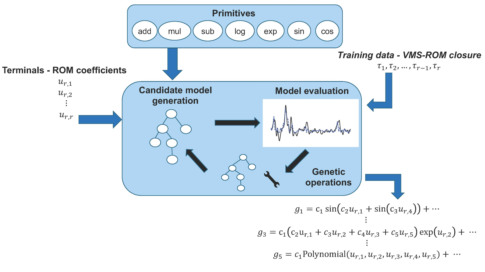

# SR-ROM

<p align="center">

</p>

This repository contains the code used to produce the results of the paper [Symbolic Regression of Data-Driven Reduced Order Model Closures for Under-Resolved, Convection-Dominated Flows
](https://arxiv.org/abs/2502.04703v1).

## Installation

The dependencies are collected in `environment.yaml` and can be installed, after cloning the repository, using [`mamba`]("https://github.com/mamba-org/mamba"):

```bash
$ mamba env create -f environment.yaml
```

Once the environment is installed and activated, install the library using

```bash
$ pip install .
```

## Usage

To train the ML-VMS-ROMs, download the data available [here](https://drive.google.com/drive/folders/16rg1L3277Dp9IOpxF818vxinQVYy5bdn) and move them using

```bash
$ mv data/* src/sr_rom/data/
```

Then, just run

```bash
$ python src/sr_rom/compute_results.py --bench_name {bench_name} --method {method} --re {re}
```

where `{bench_name}` is either `2dcyl` or `ldc`, `{method}` is one of `LR`, `NN` and `SR`, and `{re}` is the Reynold number. The possible values to be chosen for `re` are:

- `{400,500}` for 2D flow past a cylinder (2dcyl)
- `{10000, 15000, 20000}` for lid driven cavity (ldc)

## Citing

```
@article{manti2025symbolic,
  title={Symbolic regression of data-driven reduced order model closures for under-resolved, convection-dominated flows},
  author={Manti, Simone and Tsai, Ping-Hsuan and Lucantonio, Alessandro and Iliescu, Traian},
  journal={Journal of Computational Physics},
  year={2025}
}
```
